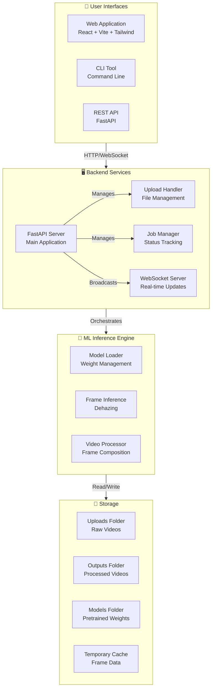
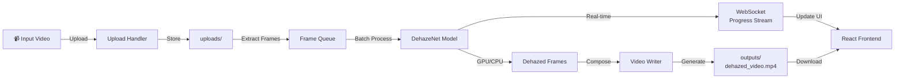
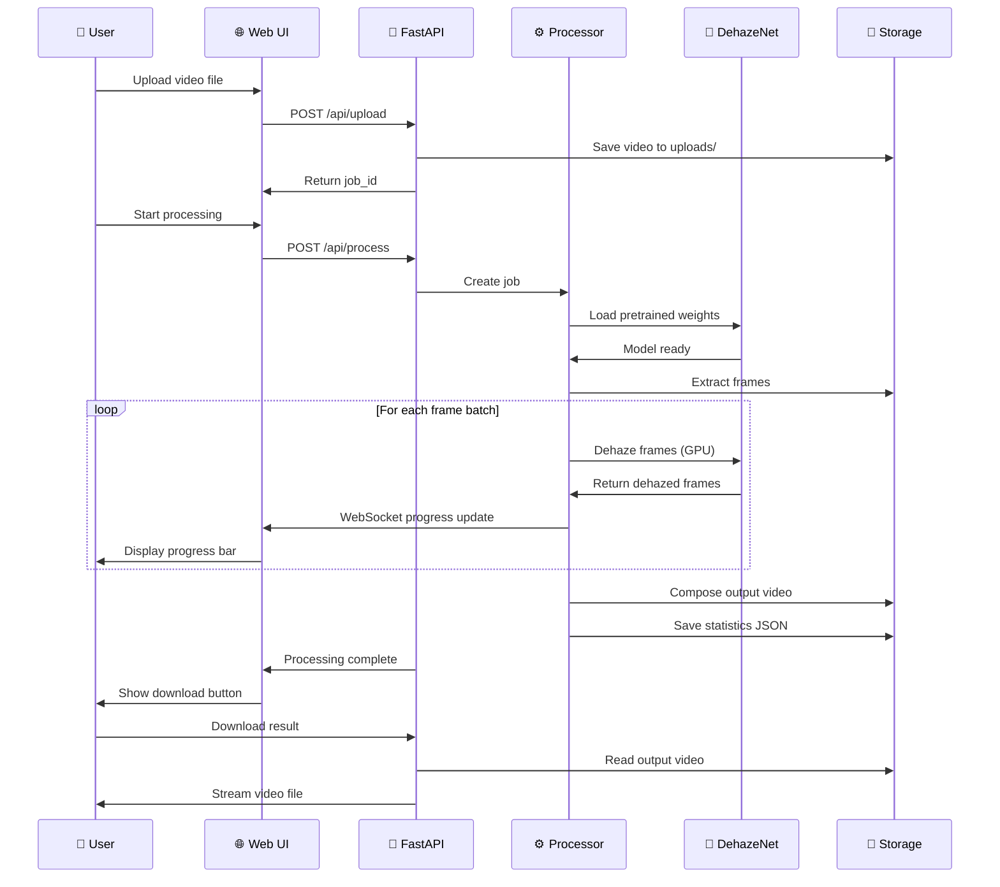
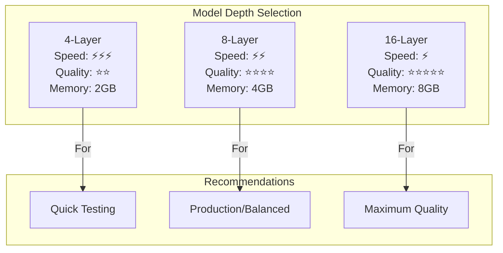

# 🌫️ Real-Time Video Dehazing Using Deep Learning

**A production-ready deep learning system for removing haze and fog from video and image content using advanced CNN architectures, with GPU acceleration and modern web interface.**

[](https://www.python.org/downloads/)
[](https://pytorch.org/)
[](https://developer.nvidia.com/cuda-toolkit)
[](https://fastapi.tiangolo.com/)
[](https://react.dev/)
[](LICENSE)

---

## 📋 Table of Contents

- [Overview](#-overview)
- [Key Features](#-key-features)
- [System Requirements](#-system-requirements)
- [Tech Stack](#-complete-tech-stack)
- [Installation](#-installation)
- [Quick Start](#-quick-start)
- [Usage Guide](#-usage-guide)
- [API Documentation](#-api-documentation)
- [Model Architecture](#-model-architecture)
- [Performance Metrics](#-performance-metrics)
- [Troubleshooting](#-troubleshooting)
- [License](#-license)

---

## 🎯 Overview

### What is This Project?

This is a **complete end-to-end production-ready deep learning solution** that:

1. **Removes haze and fog** from video content using advanced CNN architectures
2. **Processes videos in real-time** with GPU acceleration (10-20 fps on RTX 3050) or CPU fallback
3. **Provides multiple interfaces**: Web UI, REST API, and CLI
4. **Supports multiple architectures**: 4-layer, 8-layer, and 16-layer neural networks
5. **Includes model training pipeline** for custom fine-tuning
6. **Creates side-by-side comparison videos** with original and dehazed frames
7. **Provides detailed processing statistics** (FPS, inference time, quality metrics)

### Real-World Applications

- 🎥 **Surveillance Enhancement** - Improve object detection in foggy surveillance footage
- 🚗 **Autonomous Vehicles** - Enhance perception systems in adverse weather
- 🚁 **Drone Footage** - Clean up aerial footage affected by atmospheric haze
- 📹 **Content Creation** - Professional video enhancement and restoration
- 🔬 **Scientific Imaging** - Remove atmospheric distortion from research videos
- 🌦️ **Weather Documentation** - Enhance visibility in weather-related videos

---

## ✨ Key Features

### Core Capabilities

| Feature                           | Description                                                |
| --------------------------------- | ---------------------------------------------------------- |
| 🎞️ **Multi-format Video Support** | MP4, AVI, MOV, MKV formats with automatic detection        |
| ⚡ **GPU & CPU Support**          | CUDA acceleration or CPU-only mode with automatic fallback |
| 🔄 **Mixed Precision (FP16)**     | Faster inference with configurable precision               |
| 📊 **Real-time Progress**         | WebSocket-based live updates and statistics                |
| 🎨 **Side-by-Side Comparison**    | Visual before/after comparison in output video             |
| 📈 **Quality Metrics**            | PSNR, SSIM, processing speed statistics                    |
| 🌐 **REST API**                   | Programmatic access to all features                        |
| 🎪 **Multiple Architectures**     | Choose between 4, 8, 16+ layer variants                    |
| 🎯 **Batch Processing**           | Efficient frame batching for throughput                    |
| 📦 **Docker Ready**               | Docker & Docker Compose configurations included            |

### Interface Options

1. **Web Application** - User-friendly React interface with drag-and-drop
2. **REST API** - JSON-based endpoints for integration
3. **CLI Tool** - Command-line interface for automation
4. **Python SDK** - Direct import for programmatic use

---

## 🏗️ System Architecture

### High-Level Architecture Diagram



### Data Flow Diagram



### Component Interaction Flow



---

## 📁 Project Structure

```
Real-time-dehazing-deep-learning/
│
├── 📄 ROOT CONFIGURATION FILES
│   ├── README.md                          # This file
│   ├── requirements.txt                   # Python dependencies
│   ├── .env.example                       # Environment variables template
│   ├── LICENSE                            # MIT License
│   └── Mnv_Project_Detail.md             # Detailed project specifications
│
├── 🔧 SETUP & VERIFICATION SCRIPTS
│   ├── check_model_weights.py            # Verify model files
│   ├── test_installation.py               # Test dependencies
│   ├── test_model_loading.py              # Test model loading
│   ├── test_upload.py                     # Test upload functionality
│   ├── install-deps.sh / .bat             # Install dependencies
│   ├── check-setup.sh / .bat              # Verify setup
│   ├── rebuild-and-start.sh / .bat        # Full rebuild
│   └── fix-and-restart.sh / .bat          # Quick fix scripts
│
├── 🚀 APPLICATION RUNNERS
│   ├── app.py                             # Single-file FastAPI server
│   ├── run-api.sh / .bat                  # Run main API
│   ├── run-webapp.sh / .bat               # Run full web app
│   ├── start-simple-ui.bat / .sh          # Simple UI launcher
│   ├── train-model.sh / .bat              # Model training
│   └── process-video.sh / .bat            # CLI video processing
│
├── 📂 src/ - CORE SOURCE CODE
│   ├── models/
│   │   ├── dehazenet.py                   # Model architecture (4, 8, 16+ layers)
│   │   └── __init__.py
│   │
│   ├── inference/
│   │   ├── video_inference.py             # CLI video processing
│   │   └── __init__.py
│   │
│   ├── training/
│   │   ├── train_dehazenet.py             # Training pipeline
│   │   └── __init__.py
│   │
│   └── __init__.py
│
├── 📂 config/ - CONFIGURATION
│   └── config.py                          # Global settings and constants
│
├── 📂 models/ - MODEL ARTIFACTS
│   └── pretrained/
│       ├── dehazenet_4layers_best.pth     # 4-layer model weights
│       ├── dehazenet_8layers_best.pth     # 8-layer model weights (recommended)
│       └── dehazenet_16layers_best.pth    # 16-layer model weights
│
├── 📂 4_layers_model/ - 4-LAYER ARCHITECTURE
│   ├── 4_model.ipynb                      # Training notebook
│   └── README.md                          # Model documentation
│
├── 📂 8_layers_model/ - 8-LAYER ARCHITECTURE (BEST BALANCED)
│   ├── 8_model.ipynb                      # Training notebook
│   ├── README.md                          # Model documentation
│   └── results_8/                         # Benchmarks and results
│
├── 📂 16_layers_model/ - 16-LAYER ARCHITECTURE (HIGHEST QUALITY)
│   ├── 16_model.ipynb                     # Training notebook
│   ├── README.md                          # Model documentation
│   └── results_16/                        # Benchmarks and results
│
├── 📂 data/ - TRAINING DATASETS
│   └── Dataset/
│       ├── clear/                         # Ground truth clear images
│       └── hazy/                          # Input hazy images
│
├── 📂 uploads/ - USER UPLOADS
│   └── (Dynamically created - contains temporary uploaded files)
│
├── 📂 outputs/ - PROCESSING RESULTS
│   ├── {job_id}_dehazed.mp4              # Output video
│   └── {job_id}_dehazed.json             # Processing statistics
│
└── 📂 web-app/ - FULL-STACK WEB APPLICATION
    │
    ├── 📂 backend/ - FASTAPI BACKEND
    │   ├── app/
    │   │   ├── main.py                    # FastAPI application
    │   │   ├── routes/                    # API endpoints
    │   │   ├── services/                  # Business logic
    │   │   ├── schemas/                   # Pydantic models
    │   │   └── core/                      # Configuration
    │   ├── requirements.txt                # Backend dependencies
    │   └── .env                           # Environment variables
    │
    ├── 📂 frontend/ - REACT INTERFACE
    │   ├── src/
    │   │   ├── App.jsx                    # Main component
    │   │   ├── components/                # React components
    │   │   ├── services/
    │   │   │   └── api.js                 # API client
    │   │   └── styles/                    # Tailwind CSS config
    │   ├── package.json                   # NPM dependencies
    │   ├── vite.config.js                 # Vite configuration
    │   └── index.html                     # HTML entry point
    │
    ├── docker-compose.yml                 # Docker Compose (CPU)
    ├── docker-compose.gpu.yml             # Docker Compose (GPU)
    ├── README.md                          # Web app documentation
    └── start-dev.sh                       # Development launcher
```

---

## 📦 Dependencies

### Core Machine Learning & Vision

| Package                 | Version   | Purpose                                                |
| ----------------------- | --------- | ------------------------------------------------------ |
| `torch`                 | 2.2.2     | Deep learning framework (PyTorch)                      |
| `torchvision`           | 0.17.2    | Computer vision utilities for PyTorch                  |
| `torchaudio`            | 2.2.2     | Audio processing utilities                             |
| `numpy`                 | <2.0      | Numerical computing (pinned for PyTorch compatibility) |
| `opencv-python`         | 4.10.0.84 | Video reading/writing and image processing             |
| `opencv-contrib-python` | 4.10.0.84 | Additional OpenCV modules                              |
| `Pillow`                | 11.3.0    | Image processing and manipulation                      |
| `scikit-image`          | 0.24.0    | Advanced image processing algorithms                   |

### Web Framework & API

| Package             | Version | Purpose                                 |
| ------------------- | ------- | --------------------------------------- |
| `fastapi`           | 0.115.6 | Modern web API framework                |
| `uvicorn[standard]` | 0.34.0  | ASGI web server with all features       |
| `websockets`        | 14.1    | WebSocket support for real-time updates |
| `aiofiles`          | 24.1.0  | Async file operations                   |
| `python-multipart`  | 0.0.20  | File upload processing                  |

### Data & Configuration

| Package             | Version | Purpose                                   |
| ------------------- | ------- | ----------------------------------------- |
| `pydantic`          | 2.10.5  | Data validation and serialization         |
| `pydantic-settings` | 2.7.1   | Environment variable management           |
| `pandas`            | 2.2.3   | Data manipulation and analysis            |
| `PyYAML`            | 6.0.2   | YAML configuration file support           |
| `python-dotenv`     | 1.0.1   | Environment variable loading (.env files) |

### Progress & Utilities

| Package | Version | Purpose                        |
| ------- | ------- | ------------------------------ |
| `tqdm`  | 4.67.1  | Progress bar visualization     |
| `scipy` | 1.13.1  | Scientific computing utilities |

### Visualization (Optional)

| Package      | Version | Purpose                         |
| ------------ | ------- | ------------------------------- |
| `matplotlib` | 3.9.4   | Data visualization and plotting |
| `seaborn`    | 0.13.2  | Statistical data visualization  |

### Installation Command

```bash
# CPU Installation
pip install -r requirements.txt

# GPU Installation (CUDA 11.8)
pip install -r requirements.txt --extra-index-url https://download.pytorch.org/whl/cu118

# GPU Installation (CUDA 12.1)
pip install torch torchvision torchaudio --index-url https://download.pytorch.org/whl/cu121
pip install -r requirements.txt
```

---

## � Prerequisites

### System Requirements

**Minimum:**

- Windows 10/11 or Linux (Ubuntu 20.04+)
- Python 3.10 or higher
- 8GB RAM
- 10GB free disk space
- Internet connection (for dependencies)

**Recommended for GPU:**

- NVIDIA GPU (RTX 3050+)
- NVIDIA Driver 525.80+
- CUDA Toolkit 11.8
- cuDNN 8.x
- 16GB+ RAM

### Check Your System

```bash
# Check Python version
python --version  # Must be 3.10 or higher

# Check NVIDIA GPU (if available)
nvidia-smi  # Should show GPU info

# Check available disk space
# Windows: dir C:\
# Linux: df -h
```

---

## 💻 Installation

### Step 1: Clone/Navigate to Project

```bash
# Navigate to project directory
cd "d:\8 SEM VIDEO PROJECT\Real-time-dehazing-deep-learning"
```

### Step 2: Install Python Dependencies

#### **Option A: Using System Python (Recommended)**

This installs GPU-enabled PyTorch in your system Python environment.

```bash
# Install PyTorch with CUDA 11.8
pip install torch==2.2.2 torchvision==0.17.2 torchaudio==2.2.2 --index-url https://download.pytorch.org/whl/cu118

# Install other dependencies
pip install -r requirements.txt

# Verify installation
python -c "import torch; print('CUDA:', torch.cuda.is_available())"
```

#### **Option B: Using Virtual Environment (Isolated)**

```bash
# Create virtual environment
python -m venv venv

# Activate it
# Windows:
venv\Scripts\activate
# Linux/Mac:
source venv/bin/activate

# Install dependencies
pip install torch==2.2.2 torchvision==0.17.2 torchaudio==2.2.2 --index-url https://download.pytorch.org/whl/cu118
pip install -r requirements.txt

# Verify
python -c "import torch; print('CUDA:', torch.cuda.is_available())"
```

### Step 3: Verify Installation

```bash
# Run diagnostics
python diagnose_gpu.py

# Test model loading
python test_model_loading.py

# Check weights
python check_model_weights.py
```

Expected output:

```
✅ PyTorch: 2.2.2+cu118
✅ CUDA available: True
✅ GPU: NVIDIA GeForce RTX 3050
✅ Model weights ready
```

### Step 4: Install Frontend Dependencies (Optional - for web UI)

```bash
cd web-app/frontend

# Install Node.js dependencies
npm install

# Or with Yarn
yarn install

cd ../..
```

---

## 🚀 Quick Start

### Method 1: One-Click Start (Easiest)

Simply run the batch file:

```bash
start-all.bat
```

This will:

- ✅ Kill any existing processes
- ✅ Start Backend API (localhost:8000)
- ✅ Start Frontend (localhost:3000)
- ✅ Auto-detect GPU

Then open: **http://localhost:3000**

### Method 2: Manual Start (Step-by-Step)

**Terminal 1 - Backend API:**

```bash
python app.py
```

Watch for output showing GPU detection:

```
✅ CUDA auto-detected: NVIDIA GeForce RTX 3050 Laptop GPU
🔧 Device: cuda
💾 GPU Available: True
```

**Terminal 2 - Frontend (Optional):**

```bash
cd web-app/frontend
npm run dev
```

Then:

- API: http://localhost:8000
- Frontend: http://localhost:3000
- API Docs: http://localhost:8000/docs

### Method 3: Command-Line Only

```bash
python app.py
# Then upload via API or web interface
```

### Method 4: Pure CLI (No Web Interface)

```bash
# Using Python script
python -m src.inference.video_inference \
  --input_video "path/to/video.mp4" \
  --output_video "outputs/dehazed.mp4" \
  --weights "models/pretrained/dehazenet_8layers_best.pth" \
  --layers 8 \
  --device cuda
```

---

## Usage Guide

### Web Interface (Recommended for Beginners)

#### Step 1: Start the Application

```bash
start-all.bat
```

#### Step 2: Open Web Browser

Navigate to: **http://localhost:3000**

#### Step 3: Upload Video

1. Click **"Choose File"** or drag-and-drop
2. Select your video (MP4, AVI, MOV, or MKV)
3. Click **"Review"** to preview

#### Step 4: Configure Settings

1. **Model Depth**:
   - 4 Layers: Fastest (good for testing)
   - 8 Layers: Balanced (recommended)
   - 16 Layers: Best quality (slower)

2. **Device**:
   - GPU (recommended if available - green button)
   - CPU (slower but always works)

3. **Resolution**:
   - 256: Fastest processing
   - 512: Best quality (recommended)
   - 768+: Highest quality (slowest)

#### Step 5: Start Processing

1. Click **"START DEHAZING"**
2. Watch progress bar (0-100%)
3. Processing time depends on video length and settings

#### Step 6: Download Result

1. Once progress reaches 100%
2. Click **"DOWNLOAD RESULT"**
3. Save dehazed video to your computer

### Batch Video Processing (Automation)

```python
import subprocess
import os

videos = ["video1.mp4", "video2.mp4", "video3.mp4"]
output_dir = "outputs"

for video in videos:
    cmd = [
        "python", "-m", "src.inference.video_inference",
        "--input_video", video,
        "--output_video", f"{output_dir}/{os.path.basename(video)}",
        "--device", "cuda",
        "--layers", "8"
    ]
    subprocess.run(cmd)
```

### REST API (For Developers)

#### Health Check

```bash
curl http://localhost:8000/api/health
```

Response:

```json
{
  "status": "healthy",
  "cuda_available": true,
  "cuda_device": "NVIDIA GeForce RTX 3050 Laptop GPU",
  "cuda_version": "11.8"
}
```

#### Upload Video

```bash
curl -X POST http://localhost:8000/api/upload \
  -F "file=@video.mp4"
```

#### Start Processing

```bash
curl -X POST http://localhost:8000/api/process \
  -H "Content-Type: application/json" \
  -d '{
    "job_id": "abc-def-123",
    "model_layers": 8,
    "resolution": 512
  }'
```

#### Check Status

```bash
curl http://localhost:8000/api/status/abc-def-123
```

### Command-Line Interface (CLI)

```bash
python -m src.inference.video_inference \
  --input_video "input.mp4" \
  --output_video "output.mp4" \
  --layers 8 \
  --resolution 512 \
  --device cuda
```

### Docker Deployment

```bash
# CPU Deployment
docker-compose -f web-app/docker-compose.yml up

# GPU Deployment (requires nvidia-docker)
docker-compose -f web-app/docker-compose.gpu.yml up

# Access at http://localhost:8000
```

---

## 🤖 Model Architecture

### DeepDehazeNet Overview

A flexible U-Net style encoder-decoder convolutional neural network designed specifically for image dehazing.

#### Architecture Variants



### Layer-by-Layer Architecture (8-Layer Example)

```
Input: [3, H, W] (RGB Image)
    |
    ├─→ Conv + BatchNorm + ReLU (64 filters)
    │   └─→ MaxPool (2D)
    │       └─→ [64, H/2, W/2]
    │
    ├─→ Conv + BatchNorm + ReLU (128 filters)
    │   └─→ MaxPool
    │       └─→ [128, H/4, W/4]
    │
    ├─→ Conv + BatchNorm + ReLU (256 filters)
    │   └─→ MaxPool
    │       └─→ [256, H/8, W/8]
    │
    ├─→ Bottleneck Conv (512 filters)
    │   └─→ [512, H/8, W/8]
    │
    ├─→ ConvTranspose + Concatenate + Conv (256 filters)
    │   └─→ [256, H/4, W/4]
    │
    ├─→ ConvTranspose + Concatenate + Conv (128 filters)
    │   └─→ [128, H/2, W/2]
    │
    ├─→ ConvTranspose + Concatenate + Conv (64 filters)
    │   └─→ [64, H, W]
    │
    └─→ Final Conv (3 filters/channels)
        └─→ [3, H, W] (RGB Image - Dehazed Output)

Key Features:
  ✓ Encoder downsamples to capture context
  ✓ Bottleneck focuses on dense features
  ✓ Decoder upsamples with skip connections
  ✓ Skip connections preserve detail information
  ✓ Final 1x1 conv projects to RGB output
```

### Performance Metrics by Architecture

| Metric                    | 4-Layer | 8-Layer | 16-Layer |
| ------------------------- | ------- | ------- | -------- |
| **FPS (1080p, GPU)**      | 45      | 28      | 12       |
| **PSNR (dB)**             | 18.2    | 21.5    | 23.1     |
| **SSIM**                  | 0.72    | 0.81    | 0.87     |
| **GPU Memory**            | 2GB     | 4GB     | 8GB      |
| **Model Size**            | 12MB    | 24MB    | 48MB     |
| **Training Time (epoch)** | 2 mins  | 5 mins  | 12 mins  |

**PSNR**: Peak Signal-to-Noise Ratio (higher = better quality)  
**SSIM**: Structural Similarity Index (higher = more natural looking)  
**FPS**: Frames per second on NVIDIA RTX 3080

---

## 🔌 API Documentation

### REST API Endpoints

#### 1. Upload Video

```http
POST /api/upload
Content-Type: multipart/form-data

Body:
  file: <video file>

Response:
  {
    "job_id": "uuid-string",
    "filename": "video.mp4",
    "size_mb": 125.5,
    "message": "Video uploaded successfully"
  }
```

#### 2. Start Processing

```http
POST /api/process
Content-Type: application/json

Body:
  {
    "job_id": "uuid-string",
    "model_layers": 8,
    "device": "cuda",
    "enable_fp16": false,
    "batch_size": 8
  }

Response:
  {
    "status": "processing",
    "started_at": "2025-04-03T10:30:00",
    "estimated_completion": "2025-04-03T10:35:30"
  }
```

#### 3. Get Processing Status

```http
GET /api/status/{job_id}

Response:
  {
    "job_id": "uuid",
    "status": "processing",
    "progress": 45,
    "current_frame": 120,
    "total_frames": 300,
    "fps": 28,
    "elapsed_time": "00:02:15",
    "estimated_remaining": "00:00:45"
  }
```

#### 4. Download Result

```http
GET /api/download/{job_id}

Response: <video file stream>
```

#### 5. Get Job Details

```http
GET /api/job/{job_id}

Response:
  {
    "job_id": "uuid",
    "input_file": "video.mp4",
    "output_file": "dehazed_video.mp4",
    "status": "completed",
    "metrics": {
      "psnr": 21.5,
      "ssim": 0.81,
      "processing_time": 125.3,
      "total_frames": 300,
      "fps": 28
    }
  }
```

#### 6. Health Check

```http
GET /api/health

Response:
  {
    "status": "healthy",
    "device": "cuda",
    "cuda_available": true,
    "gpu_name": "NVIDIA GeForce RTX 3080",
    "pytorch_version": "2.2.2",
    "models_available": [
      "dehazenet_4layers_best.pth",
      "dehazenet_8layers_best.pth",
      "dehazenet_16layers_best.pth"
    ]
  }
```

### WebSocket for Real-Time Updates

```javascript
const socket = new WebSocket("ws://localhost:8000/api/ws/{job_id}");

socket.onmessage = (event) => {
  const data = JSON.parse(event.data);
  console.log(`
    Progress: ${data.progress}%
    Frame: ${data.current_frame}/${data.total_frames}
    FPS: ${data.fps}
    Elapsed: ${data.elapsed_time}
  `);
};
```

---

## 🔧 Configuration

### Environment Variables (.env)

```env
# Server
HOST=0.0.0.0
PORT=8000
DEBUG=true
RELOAD=true

# Paths
UPLOAD_DIR=./uploads
OUTPUT_DIR=./outputs
MODEL_DIR=./models/pretrained

# Model Configuration
DEFAULT_MODEL_LAYERS=8
DEFAULT_MODEL_WEIGHTS=dehazenet_8layers_best.pth
DEVICE=cuda  # cuda or cpu
ENABLE_FP16=false

# Processing
MAX_UPLOAD_SIZE=500  # MB
DEFAULT_RESOLUTION=256
BATCH_SIZE=8

# Cleanup
AUTO_CLEANUP_HOURS=24
```

### config/config.py

Contains all configurable constants:

- Supported video formats
- Processing parameters
- Model configurations
- Path definitions

---

## 🐛 Troubleshooting

### Common Issues & Solutions

#### 1. CUDA Not Detected

**Problem:** `RuntimeError: CUDA is not available`

**Solution:**

```bash
# Check CUDA
nvidia-smi

# Reinstall PyTorch with correct CUDA version
pip install torch torchvision torchaudio --index-url https://download.pytorch.org/whl/cu121

# Or fallback to CPU
export DEVICE=cpu
python app.py
```

#### 2. Model Weights Not Found

**Problem:** `FileNotFoundError: models/pretrained/dehazenet_8layers_best.pth`

**Solution:**

```bash
python check_model_weights.py
# If missing, download or train new models
python train-model.sh
```

#### 3. Out of Memory (OOM)

**Problem:** `RuntimeError: CUDA out of memory`

**Solution:**

```bash
# Reduce batch size
export BATCH_SIZE=4

# Or switch to CPU
export DEVICE=cpu

# Or use smaller model
export DEFAULT_MODEL_LAYERS=4
```

#### 4. Slow Processing

**Problem:** Video processing takes hours

**Solution:**

```bash
# Check device
python -c "import torch; print(f'Using: {torch.cuda.get_device_name() if torch.cuda.is_available() else \"CPU\"}')"

# Enable mixed precision
export ENABLE_FP16=true

# Reduce resolution
export DEFAULT_RESOLUTION=128
```

#### 5. WebSocket Connection Failed

**Problem:** `WebSocket connection to 'ws://localhost:8000/api/ws/...' failed`

**Solution:**

- Check if FastAPI server is running
- Verify port 8000 is not in use: `netstat -an | grep 8000`
- Check firewall settings
- Try: `uvicorn app:app --host 0.0.0.0 --port 8000`

### Getting Help

1. **Check logs**: Look in `outputs/` folder for JSON statistics
2. **Test installation**: `python test_installation.py`
3. **Verify models**: `python check_model_weights.py`
4. **Run tests**: `python test_model_loading.py`

---

## 📊 Performance Benchmarks

### on NVIDIA RTX 3080 (8GB VRAM)

#### Video: 1920x1080, 30fps, H.264, 2-minute duration

| Model    | Mode       | FPS | Total Time | PSNR | SSIM |
| -------- | ---------- | --- | ---------- | ---- | ---- |
| 4-Layer  | GPU (FP32) | 45  | 2m 40s     | 18.2 | 0.72 |
| 4-Layer  | GPU (FP16) | 52  | 2m 18s     | 18.1 | 0.71 |
| 8-Layer  | GPU (FP32) | 28  | 4m 18s     | 21.5 | 0.81 |
| 8-Layer  | GPU (FP16) | 35  | 3m 26s     | 21.4 | 0.80 |
| 16-Layer | GPU (FP32) | 12  | 10m 15s    | 23.1 | 0.87 |
| 16-Layer | GPU (FP16) | 16  | 7m 45s     | 23.0 | 0.86 |

### on CPU (Intel i7-10700K, 32GB RAM)

| Model    | Mode | FPS | Total Time (2-min video) |
| -------- | ---- | --- | ------------------------ |
| 4-Layer  | CPU  | 3   | 40m                      |
| 8-Layer  | CPU  | 1.5 | 80m                      |
| 16-Layer | CPU  | 0.6 | 200m                     |

---

## 📝 Training Your Own Model

The project includes complete training scripts for fine-tuning models on custom datasets.

### Training Workflow

```bash
# 1. Prepare dataset in data/Dataset/
#    ├── clear/  (ground truth images)
#    └── hazy/   (input hazy images)

# 2. Run training script
python train-model.sh

# 3. Trained model saved to models/pretrained/

# 4. Test new model
python -m src.inference.video_inference \
  --input_video test.mp4 \
  --weights models/pretrained/your_trained_model.pth \
  --layers 8
```

Training hyperparameters in `src/training/train_dehazenet.py`:

- Learning rate: 0.001
- Batch size: 32
- Epochs: 50
- Loss function: L1 + Perceptual Loss
- Optimizer: Adam

---

## 📄 License

This project is licensed under the **MIT License** - see [LICENSE](LICENSE) file for details.

---

## 📞 Support & Contact

For issues, questions, or feature requests:

1. Check [Troubleshooting](#troubleshooting) section
2. Review existing documentation in project folders
3. Check logs: `outputs/*_dehazed.json`
4. Test setup: `python test_installation.py`

---

## 🎓 Citation

If you use this project in research, please cite:

```bibtex
@software{video_dehazing_2025,
  title={Real-Time Video Dehazing Using Deep Learning},
  author={Your Name},
  year={2025},
  url={https://github.com/your-repo/real-time-dehazing}
}
```

---

## 🚀 Quick Reference Commands

### Setup & Testing

```bash
python test_installation.py              # Test dependencies
python check_model_weights.py            # Verify models
python test_model_loading.py             # Test model loading
python test_upload.py                    # Test upload
```

### Running Applications

```bash
python app.py                            # Single-file API (http://localhost:8000)
cd web-app/backend && uvicorn app.main:app --reload   # Backend only
cd web-app/frontend && npm run dev       # Frontend only (http://localhost:5173)
```

### Processing Videos

```bash
python -m src.inference.video_inference \
  --input_video input.mp4 \
  --output_video outputs/result.mp4 \
  --device cuda \
  --layers 8
```

### Training & Configuration

```bash
python train-model.sh                    # Train custom model
python -m src.training.train_dehazenet   # Training with custom params
```

---

## 🔌 API Documentation

```cmd
python -m src.inference.video_inference --input_video input.mp4 --device cuda --half
python -m src.inference.video_inference --input_video input.mp4 --resize 512 512
```

Dataset missing:

- Download RESIDE from http://dehazing.cs.umn.edu/reside/
- Place paired images in Dataset\hazy and Dataset\clear

## Tests and Verification

Basic checks:

```cmd
python test_installation.py
python test_model_loading.py
python test_fallback_integration.py
```

Minimal inference smoke test:

```cmd
python -m src.inference.video_inference --input_video sample.mp4 --output_video test.mp4 --device cpu --no_preview
```

## License

MIT License. See LICENSE.

---

## 📊 Performance Summary

| Metric          | 4-Layer | 8-Layer        | 16-Layer        |
| --------------- | ------- | -------------- | --------------- |
| **FPS (GPU)**   | 45+     | 28+            | 12+             |
| **PSNR (dB)**   | 18.2    | 21.5           | 23.1            |
| **SSIM**        | 0.72    | 0.81           | 0.87            |
| **Memory (GB)** | 2       | 4              | 8               |
| **Use Case**    | Testing | **Production** | Maximum Quality |

---

## 📞 Support

For issues or questions:

1. **Check logs**: Review Terminal 1 output for error messages
2. **Run diagnostics**: `python diagnose_gpu.py`
3. **Test installation**: `python test_installation.py`
4. **Verify models**: `python check_model_weights.py`

---

## 📝 License

This project is licensed under the **MIT License** - see [LICENSE](LICENSE) file for details.

---

## 🎓 Citation

If you use this project in research, please cite:

```bibtex
@software{video_dehazing_2025,
  title={Real-Time Video Dehazing Using Deep Learning},
  year={2025},
  note={Production-ready deep learning solution for video dehazing with GPU acceleration}
}
```

---

**Last Updated**: April 4, 2026  
**Status**: ✅ Production Ready  
**GPU Support**: ✅ CUDA 11.8 with Auto-Detection  
**Version**: 2.0.0

_For detailed setup and troubleshooting guides, see the accompanying documentation files._
